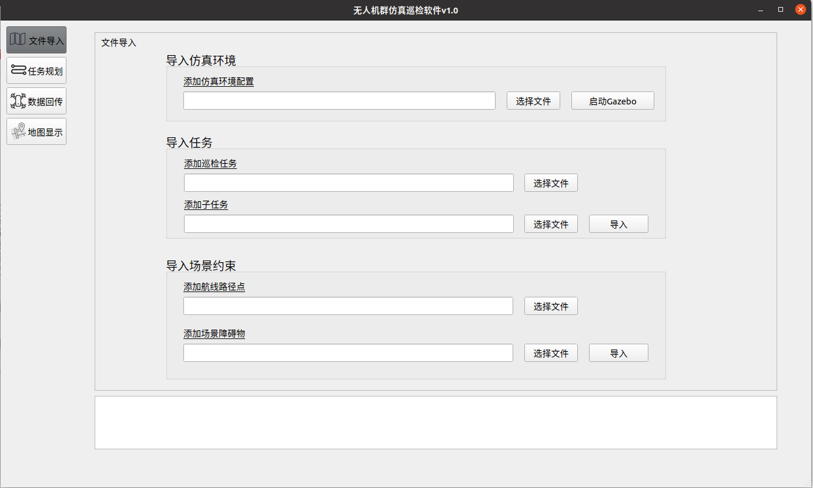
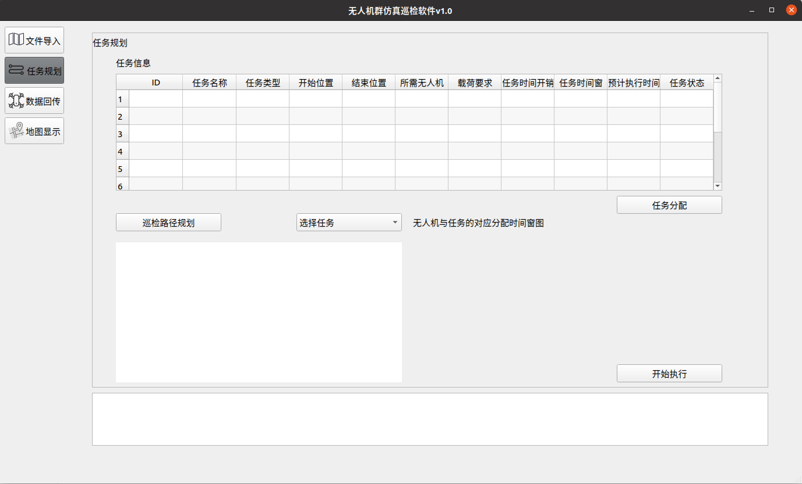
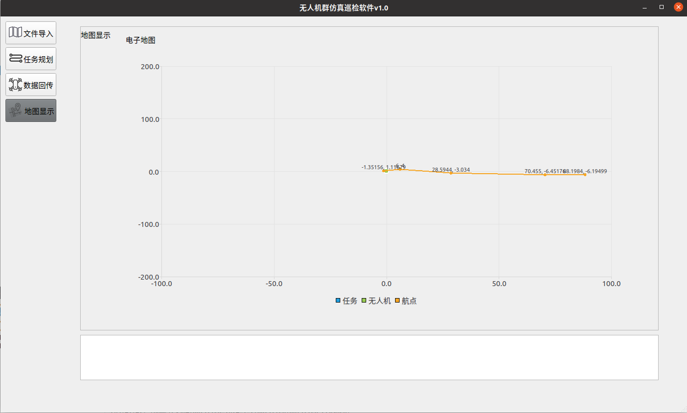

## 无人机群应用场景仿真工具

本项目基于ROS、PX4和Gazebo实现无人机的仿真，并基于QT开发了相应的图形化应用界面

### 一、无人机群仿真平台

### 项目结构介绍

- /data

  存放场景对应的任务文件

- /src

  存放本项目的功能包代码

### ROS功能包介绍

- /src/image_transport

  将无人机搭载摄像头所拍摄的图片保存至本地

- /src/task_allocation

  将任务分配给参与拍卖的无人机节点

- /src/task_loading

  读取任务信息

- /src/task_management
  
  任务管理节点用于发布任务信息
  
- /src/uav_control
  
  用于控制仿真中无人机的飞行以及发布无人机的位置信息
  
- /src/uav_msgs
  
  定义了无人机信息和任务信息的数据格式
  
- /src/view_point_plan
  
  用于对任务提取视点和进行路径规划
  
### 任务文件介绍

- /data/waypoint
  
  路径点，即任务与任务之间的飞行路线
  
- /data/task_info
  
  任务信息，对应一个设施的全部任务
  
- /data/subTask
  
  子任务信息，对应一个设施的一个特定任务
  
- /data/Obstacle
  
  障碍物信息
  
### 二、图形化界面工具

- 文件加载及仿真环境启动

  加载task_info、subTask、Obstacle、waypoint文件
  
  

- 任务规划

  进行任务分配和路径规划

  

- 无人机信息回传

  点击相应按钮启动无人机节点、显示无人机的信息

  （注：此处有绝对路径，如启动的launch文件中的无人机为两架，那么对应的分配任务和启动无人机命令也应为uavs2_bid.launch和uavs2.launch，需在qt的代码里修改）

  

- 电子地图

  展示任务、无人机等的位置信息

  

### 地面站系统

地面站系统目前正在开发中，预计的组织结构为将uav_bid功能包拆分后的拍卖节点和uav_control放在无人机机载电脑上，其余部分部署在地面站电脑上。

